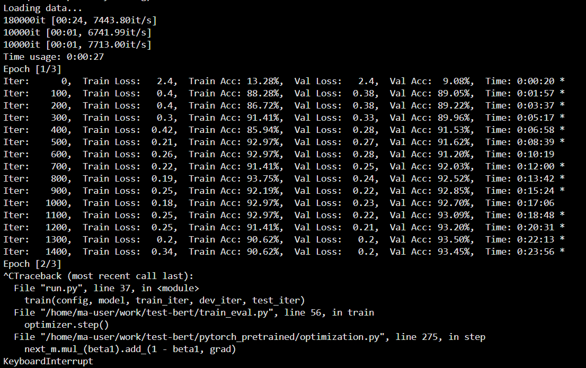

### 文本分类

参考https://github.com/Alic-yuan/nlp-beginner-finish/blob/master/task2/README.md

以及https://github.com/649453932/Bert-Chinese-Text-Classification-Pytorch

我基本上把bert分类器整个仓库搬过来了，放在test-bert目录下，但是删了一些用不到的代码。

结果：

TextRNN: 86.6%  (10 epochs, 3分钟)

TextCNN: 82.8%  (10 epochs, 3分钟)

Bert: 93.5%     (1 epoch, 25分钟)

